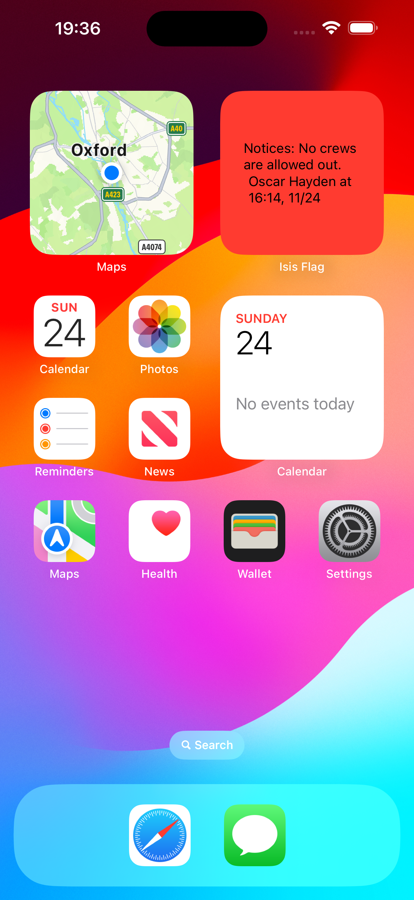

#  iOS Widget for OURCs ISIS Flag Status

> This project is still in development. The OURCs website should always be used as the authorative source of safety information.

Fetches latest status from the [OURCs API](https://ourcs.co.uk/api/flags/status/isis/) and displays along with any notices.

Example widget:

